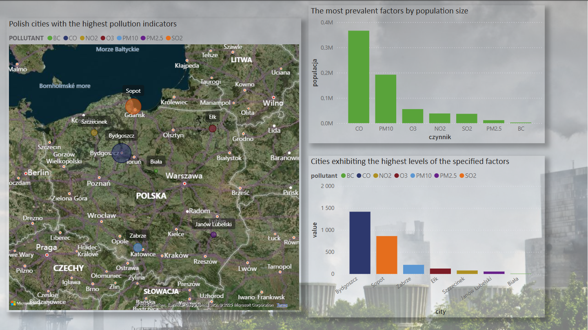
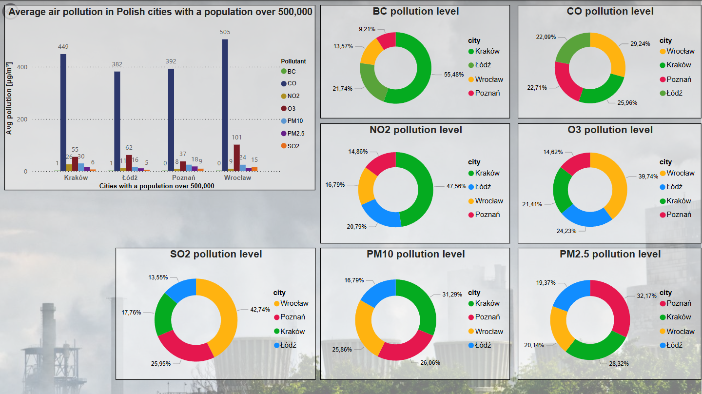

# Pollution Data Analysis Project

This project aims to analyze air pollution data across various countries and cities around the world, with a particular focus on Poland. The goal is to understand the pollution levels, factors contributing to it, and identify the cities and countries with the highest pollution levels based on population size and air quality.

## Data Sources
The data for this project was sourced from two publicly available datasets:
1. [Geonames: All Cities with a Population Over 500](https://public.opendatasoft.com/explore/dataset/geonames-all-cities-with-a-population-500/)
2. [OpenAQ: Global Air Quality Data](https://public.opendatasoft.com/explore/dataset/openaq/)

## Data Preparation
### Data Import
The data was initially downloaded in `.xlsx` (Excel) format from the following sources:
- **World Air Quality - OpenAQ** (air quality data)
- **Geonames - All Cities with a Population > 500** (population data)

### Database Creation
1. A new database was created in **Microsoft SQL Server Management Studio (SSMS)**.
2. The `.xlsx` files were imported into SSMS, where they were structured into tables.
3. SQL queries were used to clean, merge, and preprocess the data, ensuring that any duplicates were removed, missing values were handled, and relevant columns were selected for analysis.

### Data Analysis
Using SQL queries, the pollution levels were calculated for different countries and cities, segmented by population size. The analysis helped identify trends and correlations between population density and pollution levels across various regions.

## Data Visualization
The cleaned and analyzed data was then exported from SQL Management Studio and imported into **Power BI**, where several visualizations were created to represent the findings. These visualizations include bar charts, heatmaps, and scatter plots that show the air pollution levels, the most polluted cities, and the contributing factors.

### Key Insights:
- Cities with the highest population densities tend to have higher pollution levels.
- Major cities around the world (including Polish cities) show significantly high levels of air pollution.
- Specific pollutants and factors (such as PM10) were identified as key contributors in different regions.

## Technologies Used
- **SQL** for data extraction and transformation
- **Microsoft SQL Server Management Studio (SSMS)** for data management
- **Power BI** for data visualization
- **OpenAQ** and **Geonames** for data sources

## How to Run the Project
1. Clone the repository.
2. Import the `.pbix` file into Power BI.
3. (Optional) You can replicate the data preparation process by accessing the datasets from Open DataSoft and using SQL queries to recreate the cleaning and merging steps.

## Screenshots
- 
- 

## Conclusion
This project provides valuable insights into the air pollution levels across the globe, with a focus on cities and countries with the highest pollution rates. It highlights the relationship between population size and pollution, showcasing the areas that need immediate attention to improve air quality.

## License
This project is open source and available under the [MIT License](LICENSE).
